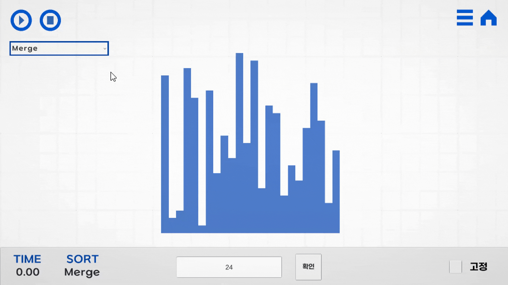
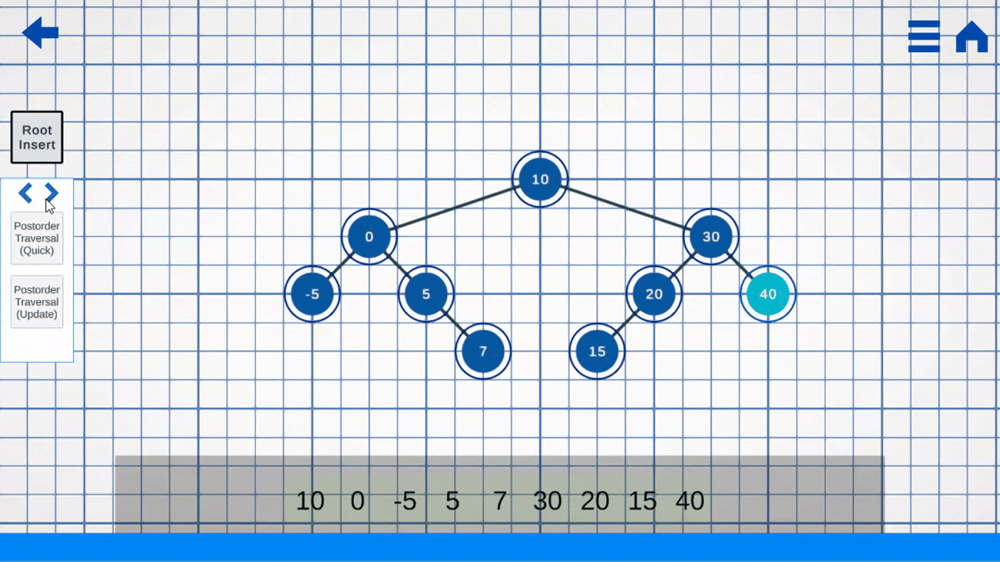

# AlgorithmUnity

**알고리즘, 자료구조의 동작 구조를 유니티로 시각화하여 보여주는 개인 프로젝트.**


## 1. 개발된 기능
### 기본 정렬 알고리즘 (버블, 삽입, 머지 소팅 등등)의 시각화.



### 이진 정렬 트리의 삽입, 삭제, 검색 시각화.
- **추가**

- **삭제**


### 트리 순회



- 현재도 계속 기능 개발중.

## 2.기술적 특징
### 트리 레이아웃 알고리즘
  - 트리의 노드들이 겹치지 않으면서 동적으로 생성 및 배치가 될 수 있도록 하는 알고리즘 적용

  
### 함수 지연된 실행 관리
  - IEnumerator, IEnumerable, yield return을 활용하여 재귀 함수의 실행 흐름을 동적 조절

| 후위 순회를 IEnumerator를 응용하여 구현한 예시 
``` csharp 
    public IEnumerator CoroutinePostorderTraversal(Node node, float seconds)
    {
        if (node == null){
            yield break;
        }

        IEnumerator leftenumerator = CoroutinePostorderTraversal(node.left, seconds);
        while(leftenumerator.MoveNext()){
            yield return new WaitForSeconds(seconds);
        }
        
        IEnumerator rightenumerator = CoroutinePostorderTraversal(node.right, seconds); 
        while(rightenumerator.MoveNext()){
            yield return new WaitForSeconds(seconds);
        }
           
        UpdateTraversalNodeVisual(ref node);
        yield return new WaitForSeconds(seconds);
    }

  ```

위 코드를 원하는 방식으로 제어하는 메서드
```csharp

    public void SetTraversalMode(TraversalMode? mode){
        if(mode == null) return;
        switch(mode){
            case TraversalMode.InOrder:
                enumerateTraversal = BTree.CoroutineInorderTraversal(_traversalStartNode, _perSec);;
                break;
            case TraversalMode.PreOrder:
                enumerateTraversal = BTree.CoroutinePreorderTraversal(_traversalStartNode, _perSec);
                break;
            case TraversalMode.PostOrder:
                enumerateTraversal = BTree.CoroutinePostorderTraversal(_traversalStartNode, _perSec);
                break;
            case TraversalMode.LevelOrder:
                enumerateTraversal = BTree.CoroutineLevelorderTraversal(_traversalStartNode, _perSec);
                break;
        }
    }

  //한번에 순회
    public void EnumerateCoroutineTraversal(){
        if(_traversalCoroutine != null){
            StopCoroutine(_traversalCoroutine);
            TraversalReset();
        }
        _traversalCoroutine = StartCoroutine(enumerateTraversal);
    }

  //버튼을 누를 때 마다 단계별로 순회
    public void EnumerateStepTraversal(){
        if(!enumerateTraversal.MoveNext()){
            TraversalReset();
        }
    }
  ```

| 그 외 머지 소팅에서의 사용 예시
  ```csharp

      public IEnumerator UpdateSort(){
        _isSortFinish = false;
        Queue<List<int>> q = new();
        for(int i=0; i<_sortList.Count; i++){
            List<int> temp = new();
            temp.Add(_sortList[i].value);
            q.Enqueue(temp);
        }

        int idx = 0;
        while(q.Count > 0){
            List<int> left = q.Dequeue();
            q.TryDequeue(out List<int> right);
            List<int> merge = sorting(ref left, ref right);
            
            foreach(int i in merge){
                ChangeElement(idx, i);
                idx++;
                AddTime(0.1f);
                yield return new WaitForSeconds(0.1f);
                if (idx == _sortList.Count) {
                    idx = 0;
                    break;
                }
            }
            if(merge.Count < _sortList.Count){
                q.Enqueue(merge);
            }
            else if(merge.Count == _sortList.Count){
                if(right == null){
                    break;
                }
                else if(left.Count != right.Count){
                    q.Enqueue(merge);
                }
            }  
        }

        _isSortFinish = true;
    }
  ```


- **DOTWEEN** 
  - 부드러운 애니메이션 구현을 위한 DOTWEEN패키지 활용

## 🛠️ 기술 스택
 


