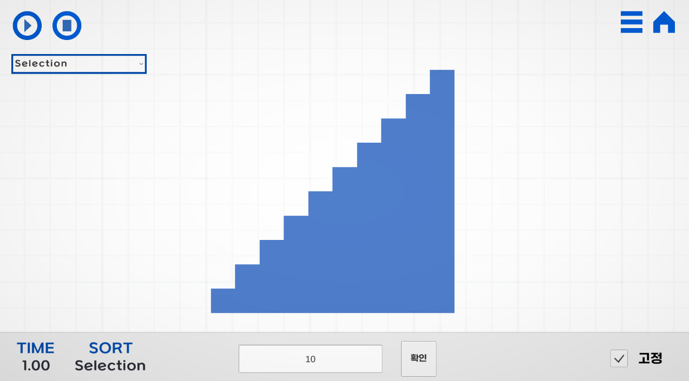
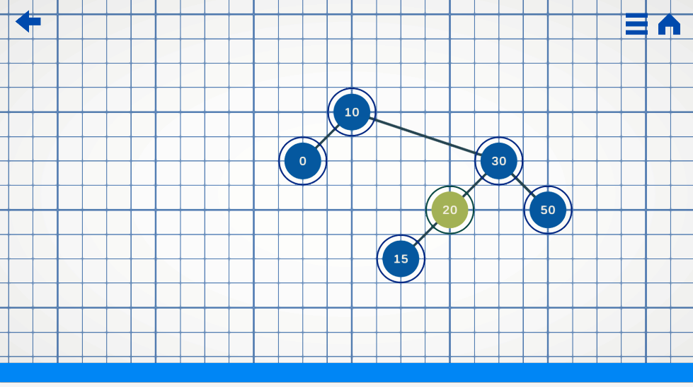

# 💻AlgorithmUnity
## 🚀 소개
### 프로젝트 소개
알고리즘, 자료구조의 동작 구조를 유니티로 시각화하여 보여주는 프로젝트.

### 개발된 기능
- 기본 정렬 알고리즘 (버블, 삽입, 머지 소팅 등등)의 시각화.

- 이진 정렬 트리의 삽입, 삭제, 검색 시각화.

- 트리 순회

- 현재도 계속 기능 개발중.

### 기술적 특징
- **트리 레이아웃 알고리즘**
  - 트리의 노드들이 겹치지 않으면서 동적으로 생성 및 배치가 될 수 있도록 하는 알고리즘 적용

  
- **함수 지연된 실행 관리**
  - IEnumerator, IEnumerable, yield return을 활용하여 재귀 함수의 실행 흐름을 동적 조절

- **DOTWEEN** 
  - 부드러운 애니메이션 구현을 위한 DOTWEEN패키지 활용용

## 🛠️ 기술 스택
 

